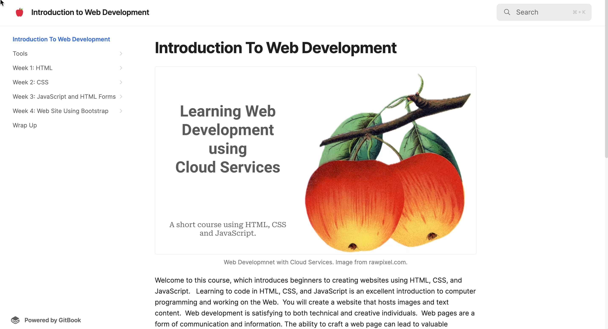

# Project 10 - Gitbook: Intro to Web Development

## Links

[Book](https://rpeltz.gitbook.io/introduction-to-web-development) 

## Description
A book that introduces to student to project based learning with a four week course in creating websites using HTML, CSS, and JavaScript.

## Tools/Technology 
This book is written using the online gitbook.com editor and hosting. This supports a four week course that introduces students to web development and programming.

