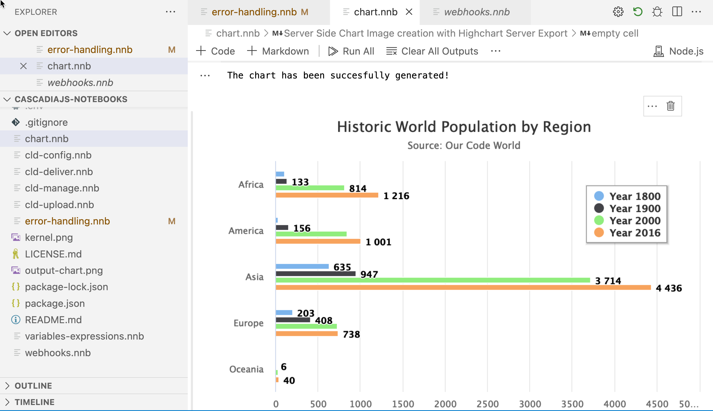

# Project 11 - VS Code Notebooks

## Links

[Code Notebook](https://github.com/rebeccapeltz/cascadiajs-notebooks) 

## Description
I gave a talk at Cascadia JS in 2022 about using Code Notebooks in Visual Studio Code.  This notebook I created for this was written in Node.js for JavaScript developers.

## Tools/Technology 
Code notebooks can be crafted in Visual Studio Code.  They support many languages including Nodejs.  

