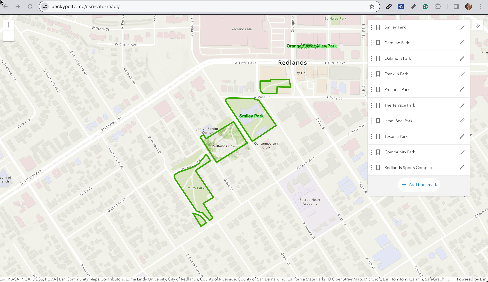

# Project 9 - Hosting Esri Map in React

## Links

[Code](https://github.com/rebeccapeltz/esri-vite-react)
 
[Table](https://www.beckypeltz.me/esri-vite-react/) 

## Description
AcrGIS Maps can be served using the [ESRI JavaScript API](https://developers.arcgis.com/javascript/latest/). 

## Tools/Technology 
This application is built using React.js started with Vite.

